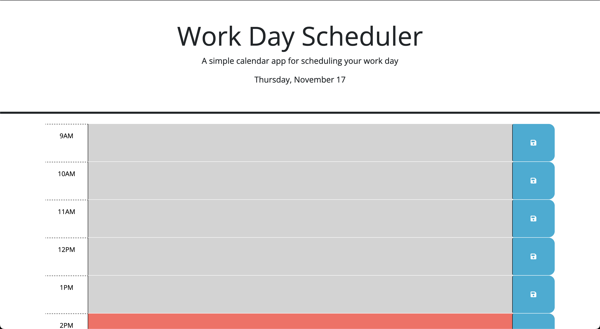

# Work Day Scheduler

## Description

https://antced.github.io/work-day-scheduler/

A daily planner that allows users to schedule tasks and have them persist on refresh. It includes the following features:

- Buttons that save tasks to local storage
- Today's date
- Color changing tasks based on the time of day
- Day.js

## Credits

Worked on as a project for UPENN's coding bootcamp under the instruction of Leif Hetland. Relies on Day.js API.